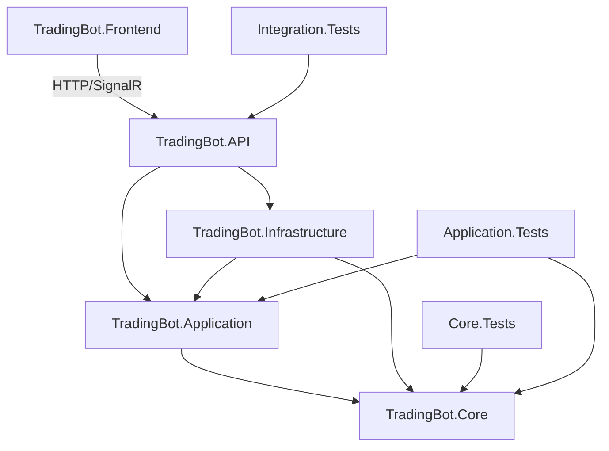

# TradingBot — Documentación del Proyecto

## 📌 Descripción General

**TradingBot** es un sistema autónomo de trading para Binance que ejecuta estrategias
y reglas configuradas por el usuario. Opera 24/7 procesando datos de mercado en tiempo
real vía WebSocket, tomando decisiones de compra/venta basadas en reglas configurables
que pueden modificarse **sin reiniciar el sistema** (hot-reload).

---

## 🎯 Objetivos del Sistema

| Objetivo           | Descripción                                                           |
|--------------------|-----------------------------------------------------------------------|
| **Autonomía**      | Opera sin intervención humana continua siguiendo reglas configuradas  |
| **Tiempo real**    | Procesa ticks de mercado con latencia < 100ms                         |
| **Flexibilidad**   | Estrategias y reglas modificables en tiempo de ejecución              |
| **Seguridad**      | Gestión de riesgo integrada, modo paper trading, límites configurables|
| **Observabilidad** | Dashboard en tiempo real, historial de operaciones, alertas           |

---

## 🏛️ Arquitectura

### Capas del Sistema
```
┌─────────────────────────────────────────────┐ │         
Blazor WebAssembly (Frontend)        │ │   Dashboard │ 
Config Estrategias │ Órdenes   │ 
└──────────────────────┬──────────────────────┘ │
SignalR / HTTP 
┌──────────────────────┴──────────────────────┐ │              
.NET 9 Web API                  │ │         Controllers │ 
SignalR Hubs           │ 
└──────────────────────┬──────────────────────┘ │ 
┌──────────────────────┴──────────────────────┐ │           
Application Layer (CQRS)           │ │  StrategyEngine │ 
RuleEngine │ RiskManager   │ │  OrderManager   │ 
MarketEngine               │ 
└──────┬───────────────────────────┬──────────┘ │                           
│ ┌──────┴───────┐         ┌─────────┴─────────┐ │  
PostgreSQL  │         │   Binance API      │ │  + Redis     │         
│  REST + WebSocket  │ └──────────────┘         
└───────────────────┘
```
---

## 🧩 Componentes Principales

### 1. Market Engine
Responsable de mantener la conexión WebSocket con Binance y distribuir eventos de mercado.

- **Entrada**: Streams de Binance (price ticks, order book, trades)
- **Salida**: Eventos `MarketTickReceived` publicados en el bus interno
- **Resiliencia**: Reconexión automática con backoff exponencial

### 2. Strategy Engine
Aplica indicadores técnicos al flujo de datos y genera señales de trading.

- Implementa `ITradingStrategy`
- Indicadores disponibles: RSI, MACD, EMA, SMA, Bollinger Bands
- Hot-reload: recarga configuración sin detener el procesamiento

### 3. Rule Engine
Evalúa condiciones configuradas por el usuario y decide si se debe actuar.

- Reglas definidas en JSON, persistidas en PostgreSQL
- Condiciones: precio, volumen, indicadores, tiempo, posición actual
- Lógica combinable: AND / OR / NOT entre condiciones

### 4. Risk Manager
Valida toda orden antes de su ejecución. **Obligatorio** en el flujo.

- Límites: máximo por orden, máximo diario, máximo de exposición
- Stop-loss automático configurable
- Validación de saldo disponible en tiempo real

### 5. Order Manager
Ejecuta órdenes en Binance vía REST API.

- Soporta: Market, Limit, Stop-Limit, OCO
- Modo Paper Trading: simula sin ejecutar en el exchange
- Notifica resultado a frontend vía SignalR

### 6. Config Service (Hot-Reload)
Permite modificar estrategias y reglas en tiempo de ejecución.

- API REST para CRUD de estrategias y reglas
- Validación de esquema antes de aplicar
- Publica evento `StrategyUpdated` para recarga en caliente
- Persistencia en PostgreSQL, caché en Redis

---

## 📊 Modelo de Datos Principal

### Estrategia (`TradingStrategy`)

```
{ "id": "uuid", "name": "RSI Crossover BTC", "symbol": "BTCUSDT", "isActive": true, "indicators": [ { "type": "RSI", "period": 14, "overbought": 70, "oversold": 30 } ], "entryRules": [], "exitRules": [], "riskConfig": { "maxOrderAmount": 100.0, "stopLossPercent": 2.0, "takeProfitPercent": 4.0 } }
```

### Regla (`TradingRule`)

``` 
{ "id": "uuid", "type": "Entry", "condition": { "operator": "AND", "conditions": [ { "indicator": "RSI", "comparator": "LessThan", "value": 30 }, { "indicator": "Price", "comparator": "GreaterThan", "value": 50000 } ] }, "action": { "type": "BuyMarket", "amountUsdt": 50.0 } }
```
## 🔌 API Endpoints Principales

### Estrategias

| Método   | Endpoint                        | Descripción               |
|----------|---------------------------------|---------------------------|
| `GET`    | `/api/strategies`               | Lista todas las estrategias |
| `GET`    | `/api/strategies/{id}`          | Obtiene una estrategia    |
| `POST`   | `/api/strategies`               | Crea una nueva estrategia |
| `PUT`    | `/api/strategies/{id}`          | Actualiza (hot-reload)    |
| `DELETE` | `/api/strategies/{id}`          | Elimina una estrategia    |
| `POST`   | `/api/strategies/{id}/activate` | Activa/desactiva          |

### Órdenes

| Método   | Endpoint           | Descripción          |
|----------|--------------------|----------------------|
| `GET`    | `/api/orders`      | Historial de órdenes |
| `GET`    | `/api/orders/open` | Órdenes abiertas     |
| `DELETE` | `/api/orders/{id}` | Cancela una orden    |

### Sistema

| Método | Endpoint              | Descripción       |
|--------|-----------------------|-------------------|
| `GET`  | `/api/system/status`  | Estado del bot    |
| `POST` | `/api/system/pause`   | Pausa el motor    |
| `POST` | `/api/system/resume`  | Reanuda el motor  |
| `GET`  | `/api/system/balance` | Balance de cuenta |

### SignalR Hub: `/hubs/trading`

| Evento (Server → Client) | Descripción                      |
|--------------------------|----------------------------------|
| `OnMarketTick`           | Tick de precio en tiempo real    |
| `OnOrderExecuted`        | Confirmación de orden ejecutada  |
| `OnSignalGenerated`      | Señal de entrada/salida generada |
| `OnAlert`                | Alerta de riesgo o sistema       |
| `OnStrategyUpdated`      | Confirmación de hot-reload       |

---

## ⚙️ Configuración del Entorno

### Variables de Entorno Requeridas

# Binance
BINANCE_API_KEY=your_api_key
BINANCE_API_SECRET=your_api_secret
BINANCE_USE_TESTNET=true

# Base de datos
POSTGRES_CONNECTION=Host=localhost;Database=tradingbot;Username=postgres;Password=...
REDIS_CONNECTION=localhost:6379

# Seguridad
DATA_PROTECTION_KEY_PATH=/keys
JWT_SECRET=your_jwt_secret

### Modos de Operación

| Modo           | Descripción                                |
|----------------|--------------------------------------------|
| `Live`         | Opera con dinero real en Binance           |
| `Testnet`      | Opera en el entorno de pruebas de Binance  |
| `PaperTrading` | Simula operaciones localmente sin exchange |

---

##  🚦 Diagrama de Flujo de Datos




### 📐 Máquina de estados — `Order`

```
Pending ──Submit()──► Submitted ──Fill()──────────────► Filled  ✓
                          │        └─PartialFill()──► PartiallyFilled ──Fill()──► Filled ✓
                          └──Reject()───────────────► Rejected  ✓
          └──Cancel()─────────────────────────────── ► Cancelled ✓
```
### 🗂️ Estructura del proyecto `TradingBot.Core`

```
TradingBot.Core/
├── Common/
│   ├── DomainError.cs          — Errores tipados (Validation, NotFound, Conflict…)
│   ├── Result<T,TError>.cs     — Sin excepciones para flujo de control
│   ├── Entity<TId>.cs          — Igualdad por identidad + domain events
│   └── AggregateRoot<TId>.cs   — Límite transaccional + Version (optimistic concurrency)
│
├── Enums/  (10 archivos)
│   OrderSide · OrderType · OrderStatus · StrategyStatus · TradingMode
│   IndicatorType · RuleType · ConditionOperator · Comparator · ActionType
│
├── ValueObjects/  (9 archivos)
│   Symbol · Price · Quantity · Percentage · RiskConfig · IndicatorConfig
│   LeafCondition · RuleCondition · RuleAction
│
├── Events/  (10 archivos)
│   IDomainEvent · DomainEvent (base)
│   MarketTickReceived · OrderPlaced · OrderFilled · OrderCancelled
│   SignalGenerated · StrategyUpdated · StrategyActivated · RiskLimitExceeded
│
├── Entities/  (4 archivos)
│   TradingRule · Order · Position · TradingStrategy (aggregate root)
│
└── Interfaces/
    ├── Trading/
    │   ITechnicalIndicator  — Update/Calculate/IsReady/Reset
    │   ITradingStrategy     — ProcessTickAsync / ReloadConfigAsync
    ├── Repositories/
    │   IRepository<T,TId>  — CRUD genérico base
    │   IOrderRepository    — + GetOpenOrders / GetPendingSync
    │   IStrategyRepository — + GetActive / GetWithRules
    │   IPositionRepository — + GetDailyPnL / GetOpenCount
    └── Services/
        IMarketDataService     — WebSocket stream + REST snapshot
        IStrategyConfigService — CRUD + hot-reload
        IOrderService          — PlaceOrder / Cancel / SyncStatus
        IRiskManager           — ValidateOrder (obligatorio antes de ejecutar)
        IRuleEngine            — EvaluateAsync + EvaluateExitRules
        IStrategyEngine        — Start/Stop/Pause/Resume + ReloadStrategy
```
---

## 🚀 Roadmap

### Fase 1 — MVP
- [ ] Conexión WebSocket a Binance (Testnet)
- [ ] Dashboard de precios en tiempo real
- [ ] CRUD de estrategias con hot-reload
- [ ] Motor de reglas básico (RSI, precio)
- [ ] Paper Trading funcional

### Fase 2 — Core Trading
- [ ] Ejecución real de órdenes
- [ ] Risk Manager completo
- [ ] Indicadores: MACD, EMA, Bollinger Bands
- [ ] Historial de operaciones con P&L

### Fase 3 — Avanzado
- [ ] Backtesting con datos históricos
- [ ] Múltiples exchanges (extensible)
- [ ] Notificaciones (email, Telegram)
- [ ] Análisis de performance de estrategias

---

## ⚠️ Advertencia Legal

> Este software es solo para fines educativos y de investigación.
> El trading de criptomonedas conlleva riesgos significativos de pérdida de capital.
> Los autores no son responsables de pérdidas financieras derivadas del uso de este sistema.
> **Siempre prueba exhaustivamente en Testnet/Paper Trading antes de usar dinero real.**

---

## 🔄 Estado Actual del Proyecto

### ✅ Completado

#### Paso 1 — Setup inicial
- [x] Archivo de instrucciones para Copilot → `.github/copilot-instructions.md`
- [x] Documentación del proyecto → `.github/PROJECT.md`
- [x] Estructura de la solución definida (8 proyectos: API, Core, Application, Infrastructure, Frontend, 3x Tests)

#### Paso 2 — Dominio `TradingBot.Core` (.NET 10 / C# 13)
- [x] **Enums** (10): `OrderSide`, `OrderType`, `OrderStatus`, `StrategyStatus`, `TradingMode`, `IndicatorType`, `RuleType`, `ConditionOperator`, `Comparator`, `ActionType`
- [x] **Tipos comunes**: `Result<TValue, TError>`, `DomainError`
- [x] **Base clases**: `Entity<TId>` (igualdad por identidad + domain events), `AggregateRoot<TId>` (+ `Version` para concurrencia optimista)
- [x] **Value Objects** (9): `Symbol`, `Price`, `Quantity`, `Percentage`, `RiskConfig`, `IndicatorConfig`, `LeafCondition`, `RuleCondition`, `RuleAction`
- [x] **Domain Events** (10): `MarketTickReceived`, `OrderPlaced`, `OrderFilled`, `OrderCancelled`, `SignalGenerated`, `StrategyUpdated`, `StrategyActivated`, `RiskLimitExceeded`
- [x] **Entidades** (4): `TradingRule`, `Order` *(state machine)*, `Position` *(P&L en tiempo real)*, `TradingStrategy` *(aggregate root + hot-reload)*
- [x] **Interfaces** (11):
  - Trading: `ITechnicalIndicator`, `ITradingStrategy`
  - Repositories: `IRepository<T,TId>`, `IOrderRepository`, `IStrategyRepository`, `IPositionRepository`
  - Services: `IMarketDataService`, `IStrategyConfigService`, `IOrderService`, `IRiskManager`, `IRuleEngine`, `IStrategyEngine`

---

### ⏳ En progreso — Próximo paso

**Paso 3 — Capa de Infraestructura `TradingBot.Infrastructure`**
- [ ] EF Core DbContext + migraciones (PostgreSQL)
- [ ] Repositorios: `OrderRepository`, `StrategyRepository`, `PositionRepository`
- [ ] Binance.Net: `MarketDataService` (WebSocket + REST, reconexión con backoff exponencial)
- [ ] Redis: caché de estrategias activas y precios
- [ ] Serilog: configuración de logging estructurado
- [ ] Setup Docker Compose (PostgreSQL + Redis)

---

### 📋 Pendiente

| Paso | Capa | Contenido |
|------|------|-----------|
| **4** | `TradingBot.Application` | MediatR CQRS handlers · `StrategyEngine` · `RuleEngine` · `RiskManager` · `OrderService` |
| **5** | `TradingBot.API` | Controllers REST · SignalR Hub `/hubs/trading` · Middleware (auth, throttling) |
| **6** | `TradingBot.Frontend` | Blazor WASM · Dashboard tiempo real · CRUD estrategias · Historial órdenes |
| **7** | Tests | Unit tests `Core` + `Application` · Integration tests API |

---
