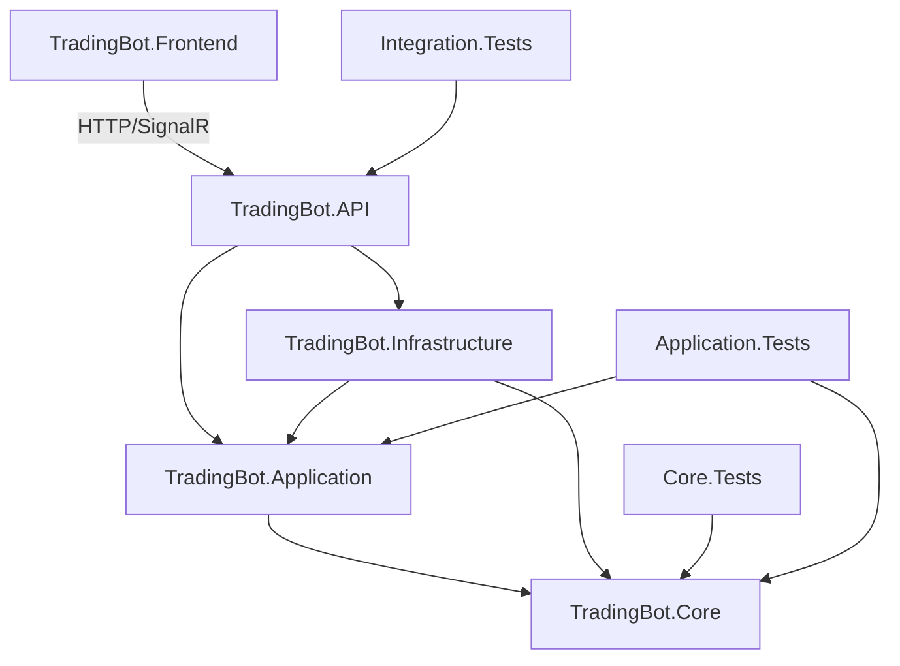

# TradingBot — Documentación del Proyecto

## 📌 Descripción General

**TradingBot** es un sistema autónomo de trading para Binance que ejecuta estrategias
y reglas configuradas por el usuario. Opera 24/7 procesando datos de mercado en tiempo
real vía WebSocket, tomando decisiones de compra/venta basadas en reglas configurables
que pueden modificarse **sin reiniciar el sistema** (hot-reload).


---

## 🎯 Objetivos del Sistema

| Objetivo           | Descripción                                                           |
|--------------------|-----------------------------------------------------------------------|
| **Autonomía**      | Opera sin intervención humana continua siguiendo reglas configuradas  |
| **Tiempo real**    | Procesa ticks de mercado con latencia < 100ms                         |
| **Flexibilidad**   | Estrategias y reglas modificables en tiempo de ejecución              |
| **Seguridad**      | Gestión de riesgo integrada, modo paper trading, límites configurables|
| **Observabilidad** | Dashboard en tiempo real, historial de operaciones, alertas           |

---

## 🏛️ Arquitectura

### Capas del Sistema
```
┌─────────────────────────────────────────────┐         │         
Blazor WebAssembly (Frontend)        │ │   Dashboard    │ 
Config Estrategias │ Órdenes   │ 
└──────────────────────┬──────────────────────┘         │
SignalR / HTTP 
┌──────────────────────┴──────────────────────┐         │              
.NET 10 Web API                 │ │         Controllers │ 
SignalR Hubs           │
└──────────────────────┬──────────────────────┘         │ 
┌──────────────────────┴──────────────────────┐         │           
Application Layer (CQRS)           │ │  StrategyEngine  │ 
RuleEngine │ RiskManager   │ │  OrderManager            │ 
MarketEngine               │ 
└──────┬───────────────────────────┬──────────┘         │                           
│ ┌──────┴───────┐         ┌─────────┴─────────┐        │  
PostgreSQL  │         │   Binance API     │ │  + Redis  │         
│  REST + WebSocket   │    └──────────────┘         
└───────────────────┘
```
---

## 🧩 Componentes Principales

### 1. Market Engine
Responsable de mantener la conexión WebSocket con Binance y distribuir eventos de mercado.

- **Entrada**: Streams de Binance (price ticks, order book, trades)
- **Salida**: Eventos `MarketTickReceived` publicados en el bus interno
- **Resiliencia**: Reconexión automática con backoff exponencial

### 2. Strategy Engine
Aplica indicadores técnicos al flujo de datos y genera señales de trading.

- Implementa `ITradingStrategy`
- Indicadores disponibles: RSI, MACD, EMA, SMA, Bollinger Bands, Fibonacci, LinearRegression, ADX, ATR
- Hot-reload: recarga configuración sin detener el procesamiento

### 3. Rule Engine
Evalúa condiciones configuradas por el usuario y decide si se debe actuar.

- Reglas definidas en JSON, persistidas en PostgreSQL
- Condiciones: precio, volumen, indicadores, tiempo, posición actual
- Lógica combinable: AND / OR / NOT entre condiciones

### 4. Risk Manager
Valida toda orden antes de su ejecución. **Obligatorio** en el flujo.

- Límites: máximo por orden, pérdida diaria (por estrategia y global), máximo de posiciones abiertas
- Exposición de portafolio: límites Long/Short, concentración por símbolo
- Esperanza matemática: bloquea estrategias no rentables (E ≤ 0 con ≥30 trades)
- Stop-loss automático: porcentual o dinámico (ATR-based), trailing stop
- Validación de saldo disponible en tiempo real (con buffer 5% para comisiones)
- Kill switch global: pérdida diaria total y drawdown de cuenta

### 5. Order Manager
Ejecuta órdenes en Binance vía REST API.

- Soporta: Market, Limit, Stop-Limit, OCO
- Modo Paper Trading: simula sin ejecutar en el exchange
- Notifica resultado a frontend vía SignalR

### 6. Config Service (Hot-Reload)
Permite modificar estrategias y reglas en tiempo de ejecución.

- API REST para CRUD de estrategias y reglas
- Validación de esquema antes de aplicar
- Publica evento `StrategyUpdated` para recarga en caliente
- Persistencia en PostgreSQL, caché en Redis

---

## 📊 Modelo de Datos Principal

### Estrategia (`TradingStrategy`)

```
{ "id": "uuid", "name": "RSI Crossover BTC", "symbol": "BTCUSDT", "isActive": true, "indicators": [ { "type": "RSI", "period": 14, "overbought": 70, "oversold": 30 } ], "entryRules": [], "exitRules": [], "riskConfig": { "maxOrderAmount": 100.0, "stopLossPercent": 2.0, "takeProfitPercent": 4.0 } }
```

### Regla (`TradingRule`)

``` 
{ "id": "uuid", "type": "Entry", "condition": { "operator": "AND", "conditions": [ { "indicator": "RSI", "comparator": "LessThan", "value": 30 }, { "indicator": "Price", "comparator": "GreaterThan", "value": 50000 } ] }, "action": { "type": "BuyMarket", "amountUsdt": 50.0 } }
```
## 🔌 API Endpoints Principales

### Estrategias

| Método   | Endpoint                                      | Descripción                      |
|----------|-----------------------------------------------|----------------------------------|
| `GET`    | `/api/strategies`                             | Lista todas las estrategias      |
| `GET`    | `/api/strategies/{id}`                        | Obtiene una estrategia           |
| `POST`   | `/api/strategies`                             | Crea una nueva estrategia        |
| `PUT`    | `/api/strategies/{id}`                        | Actualiza (hot-reload)           |
| `DELETE` | `/api/strategies/{id}`                        | Elimina una estrategia           |
| `POST`   | `/api/strategies/{id}/activate`               | Activa                           |
| `POST`   | `/api/strategies/{id}/deactivate`             | Desactiva                        |
| `POST`   | `/api/strategies/{id}/duplicate`              | Duplica con indicadores y reglas |
| `POST`   | `/api/strategies/{id}/indicators`             | Agrega indicador                 |
| `PUT`    | `/api/strategies/{id}/indicators`             | Actualiza indicador              |
| `DELETE` | `/api/strategies/{id}/indicators/{type}`      | Elimina indicador                |
| `POST`   | `/api/strategies/{id}/rules`                  | Agrega regla                     |
| `PUT`    | `/api/strategies/{id}/rules/{ruleId}`         | Actualiza regla                  |
| `DELETE` | `/api/strategies/{id}/rules/{ruleId}`         | Elimina regla                    |
| `PUT`    | `/api/strategies/{id}/optimization-profile`   | Guarda perfil de optimización    |
| `GET`    | `/api/strategies/templates`                   | Plantillas predefinidas          |

### Órdenes

| Método   | Endpoint           | Descripción          |
|----------|--------------------|----------------------|
| `GET`    | `/api/orders`      | Historial de órdenes |
| `GET`    | `/api/orders/open` | Órdenes abiertas     |
| `DELETE` | `/api/orders/{id}` | Cancela una orden    |

### Posiciones

| Método | Endpoint                   | Descripción                        |
|--------|----------------------------|------------------------------------|
| `GET`  | `/api/positions/open`      | Posiciones abiertas                |
| `GET`  | `/api/positions/closed`    | Historial de posiciones cerradas   |
| `GET`  | `/api/positions/summary`   | Resumen P&L por estrategia         |

### Backtest / Optimizador

| Método  | Endpoint                        | Descripción                         |
|---------|---------------------------------|-------------------------------------|
| `POST`  | `/api/backtest`                 | Ejecuta backtest de una estrategia  |
| `POST`  | `/api/backtest/optimize`        | Optimización de parámetros          |
| `POST`  | `/api/backtest/walk-forward`    | Walk-forward analysis               |

### Sistema

| Método | Endpoint                | Descripción                       |
|--------|-------------------------|-----------------------------------|
| `GET`  | `/api/system/status`    | Estado del bot                    |
| `POST` | `/api/system/pause`     | Pausa el motor                    |
| `POST` | `/api/system/resume`    | Reanuda el motor                  |
| `GET`  | `/api/system/symbols`   | Pares de trading (caché Redis 1h) |
| `GET`  | `/api/system/balance`   | Balance de cuenta                 |
| `GET`  | `/api/system/exposure`  | Exposición del portafolio         |

### Health Checks

| Endpoint         | Descripción                                       |
|------------------|---------------------------------------------------|
| `/health`        | Todos los checks                                  |
| `/health/ready`  | DB + Redis + Binance (readiness)                  |
| `/health/live`   | Strategy Engine (liveness)                        |

### SignalR Hub: `/hubs/trading`

| Evento (Server → Client) | Descripción                      |
|--------------------------|----------------------------------|
| `OnMarketTick`           | Tick de precio en tiempo real    |
| `OnOrderExecuted`        | Confirmación de orden ejecutada  |
| `OnSignalGenerated`      | Señal de entrada/salida generada |
| `OnAlert`                | Alerta de riesgo o sistema       |
| `OnStrategyUpdated`      | Confirmación de hot-reload       |

---

## ⚙️ Configuración del Entorno

### Variables de Entorno

```bash
# Binance
BINANCE_API_KEY=your_api_key
BINANCE_API_SECRET=your_api_secret
BINANCE_USE_TESTNET=true          # true = testnet.binance.vision
BINANCE_USE_DEMO=false            # true = demo.binance.com

# Base de datos
REDIS_CONNECTION=localhost:6379

# Autenticación API
TRADINGBOT_API_KEY=your_secret_api_key   # Header X-Api-Key
```

> **Nota**: Las connection strings de PostgreSQL se configuran en `appsettings.json`.
> Si `TRADINGBOT_API_KEY` está vacío, la API funciona sin autenticación (solo desarrollo).

### Modos de Operación

| Modo           | Descripción                                |
|----------------|--------------------------------------------|
| `Live`         | Opera con dinero real en Binance           |
| `Testnet`      | Opera en el entorno de pruebas de Binance  |
| `PaperTrading` | Simula operaciones localmente sin exchange |

---

##  🚦 Diagrama de Flujo de Datos




### 📐 Máquina de estados — `Order`

```
Pending ──Submit()──► Submitted ──Fill()──────────────► Filled  ✓
                          │        └─PartialFill()──► PartiallyFilled ──Fill()──► Filled ✓
                          └──Reject()───────────────► Rejected  ✓
          └──Cancel()─────────────────────────────── ► Cancelled ✓
```
### 🗂️ Estructura del proyecto `TradingBot.Core`

```
TradingBot.Core/
├── Common/
│   ├── DomainError.cs          — Errores tipados (Validation, NotFound, Conflict…)
│   ├── Result<T,TError>.cs     — Sin excepciones para flujo de control
│   ├── Entity<TId>.cs          — Igualdad por identidad + domain events
│   └── AggregateRoot<TId>.cs   — Límite transaccional + Version (optimistic concurrency)
│
├── Enums/  (11 archivos)
│   OrderSide · OrderType · OrderStatus · StrategyStatus · TradingMode
│   IndicatorType · RuleType · ConditionOperator · Comparator · ActionType
│   MarketRegime
│
├── ValueObjects/  (12 archivos)
│   Symbol · Price · Quantity · Percentage · RiskConfig · IndicatorConfig
│   LeafCondition · RuleCondition · RuleAction · SavedParameterRange
│   AccountBalance · ExchangeSymbolFilters
│
├── Events/  (10 archivos)
│   IDomainEvent · DomainEvent (base)
│   MarketTickReceived · OrderPlaced · OrderFilled · OrderCancelled
│   SignalGenerated · StrategyUpdated · StrategyActivated · RiskLimitExceeded
│
├── Entities/  (4 archivos)
│   TradingRule · Order · Position · TradingStrategy (aggregate root)
│
└── Interfaces/  (19 archivos)
    ├── IUnitOfWork
    ├── Trading/
    │   ITechnicalIndicator  — Update/Calculate/IsReady/Reset
    │   ITradingStrategy     — ProcessTickAsync / ReloadConfigAsync / CurrentRegime / CurrentAtrValue
    ├── Repositories/
    │   IRepository<T,TId>   — CRUD genérico base
    │   IOrderRepository     — + GetOpenOrders / GetPendingSync
    │   IStrategyRepository  — + GetActive / GetWithRules
    │   IPositionRepository  — + GetDailyPnL / GetOpenCount / GetTradeStats
    └── Services/
        IMarketDataService      — WebSocket stream + REST snapshot + Klines + Symbols
        IStrategyConfigService  — CRUD + hot-reload
        IOrderService           — PlaceOrder / Cancel / SyncStatus
        IRiskManager            — ValidateOrder + exposición portafolio + esperanza
        IRuleEngine             — EvaluateAsync + EvaluateExitRules (ATR/trailing)
        IStrategyEngine         — Start/Stop/Pause/Resume + ReloadStrategy
        ISpotOrderExecutor      — PlaceOrder / CancelOrder / GetStatus (Binance REST)
        IAccountService         — GetBalance / GetSnapshot / InvalidateCache
        IExchangeInfoService    — GetFilters (LOT_SIZE, PRICE_FILTER, MIN_NOTIONAL)
        ICacheService           — Get/Set/Remove (Redis)
        ITradingNotifier        — SignalR push (ticks, órdenes, señales, alertas)
        IUserDataStreamService  — WebSocket User Data Stream (order fills, balance)
```
---

## 🚀 Roadmap

### Fase 1 — MVP
- [x] Conexión WebSocket a Binance (Testnet)
- [x] Dashboard de precios en tiempo real
- [x] CRUD de estrategias con hot-reload
- [x] Motor de reglas básico (RSI, precio)
- [x] Paper Trading funcional

### Fase 2 — Core Trading
- [x] Ejecución real de órdenes (Binance Testnet) — `BinanceSpotOrderExecutor` + `UserDataStreamService`
- [x] Risk Manager completo (límites por orden, diario, global + esperanza matemática + portafolio)
- [x] Indicadores: MACD, EMA, SMA, Bollinger Bands, Fibonacci, LinearRegression, ADX, ATR
- [x] Historial de operaciones con P&L + fees
- [x] Backtesting con datos históricos + fees + slippage
- [x] Optimizador de parámetros (cartesiano, walk-forward, persistencia de perfil)
- [x] Análisis de performance (Sharpe, Sortino, Calmar, ProfitFactor)
- [x] Autenticación API Key + Rate Limiting
- [x] Health Checks + métricas OpenTelemetry
- [x] CI/CD (GitHub Actions) + Docker + Docker Compose producción

### Fase 3 — Avanzado
- [ ] Múltiples exchanges (extensible)
- [ ] Notificaciones (email)
- [ ] Protocolo de activación Live con dinero real

---

## ⚠️ Advertencia Legal

> Este software es solo para fines educativos y de investigación.
> El trading de criptomonedas conlleva riesgos significativos de pérdida de capital.
> Los autores no son responsables de pérdidas financieras derivadas del uso de este sistema.
> **Siempre prueba exhaustivamente en Testnet/Paper Trading antes de usar dinero real.**

---

## 🔄 Estado Actual del Proyecto

### ✅ Completado

#### Paso 1 — Setup inicial
- [x] Archivo de instrucciones para Copilot → `.github/copilot-instructions.md`
- [x] Documentación del proyecto → `.github/PROJECT.md`
- [x] Estructura de la solución definida (8 proyectos: API, Core, Application, Infrastructure, Frontend, 3x Tests)

#### Paso 2 — Dominio `TradingBot.Core` (.NET 10 / C# 14)
- [x] **Enums** (11): `OrderSide`, `OrderType`, `OrderStatus`, `StrategyStatus`, `TradingMode`, `IndicatorType`, `RuleType`, `ConditionOperator`, `Comparator`, `ActionType`, `MarketRegime`
- [x] **Tipos comunes**: `Result<TValue, TError>`, `DomainError`
- [x] **Base clases**: `Entity<TId>` (igualdad por identidad + domain events), `AggregateRoot<TId>` (+ `Version` para concurrencia optimista)
- [x] **Value Objects** (12): `Symbol`, `Price`, `Quantity`, `Percentage`, `RiskConfig`, `IndicatorConfig`, `LeafCondition`, `RuleCondition`, `RuleAction`, `SavedParameterRange`, `AccountBalance`, `ExchangeSymbolFilters`
- [x] **Domain Events** (10): `MarketTickReceived`, `OrderPlaced`, `OrderFilled`, `OrderCancelled`, `SignalGenerated`, `StrategyUpdated`, `StrategyActivated`, `RiskLimitExceeded`
- [x] **Entidades** (4): `TradingRule`, `Order` *(state machine + Fee)*, `Position` *(P&L en tiempo real + peak tracking)*, `TradingStrategy` *(aggregate root + hot-reload)*
- [x] **Interfaces** (19): ver estructura de proyecto para listado completo

---

### ✅ Completado (pasos 3–12)
#### Paso 3 — Capa de Infraestructura `TradingBot.Infrastructure` ✅
- [x] Repositorios: `OrderRepository`, `StrategyRepository`, `PositionRepository`
- [x] Binance.Net: `MarketDataService` (WebSocket + REST, reconexión con backoff exponencial)
- [x] Redis: caché de estrategias activas y precios (`ICacheService` + `RedisCacheService`)
- [x] Serilog: configuración de logging estructurado (Console + File, request logging)
- [x] Setup Docker Compose (PostgreSQL + Redis)
- [x] EF Core: migraciones iniciales (`InitialCreate` — 4 tablas: Orders, Positions, TradingStrategies, TradingRules)

#### Paso 3 — Fixes aplicados
- [x] **Fix `IndicatorConfig`**: `{ get; init; }` + constructor parameterless privado para EF Core design-time
- [x] **`DesignTimeDbContextFactory`**: permite generar migraciones sin PostgreSQL/Redis corriendo
- [x] **`modelBuilder.Ignore<IndicatorConfig>()`**: evita que EF Core intente mapear `IReadOnlyDictionary` como columna
- [x] **`dotnet-ef` actualizado**: de v9.0.8 a v10.0.3

#### Paso 4 — Capa de Aplicación `TradingBot.Application`
- [x] MediatR CQRS: 7 command handlers (`Create/Update/Activate/Deactivate/Delete Strategy`, `PlaceOrder`, `CancelOrder`)
- [x] MediatR Queries: 4 query handlers (`GetAllStrategies`, `GetStrategyById`, `GetOpenOrders`, `GetOrdersByDateRange`)
- [x] FluentValidation: `CreateStrategyCommandValidator`, `PlaceOrderCommandValidator`
- [x] `ValidationBehavior<TRequest, TResponse>` (MediatR pipeline)
- [x] `StrategyConfigService` (CRUD + cache Redis + hot-reload event)
- [x] `OrderService` (RiskManager obligatorio → Paper Trading con precio real de Binance REST)
- [x] `RiskManager` (max orden, pérdida diaria, posiciones abiertas)
- [x] `RuleEngine` (AND/OR/NOT conditions, stop-loss y take-profit automáticos)
- [x] `DefaultTradingStrategy` (RSI oversold/overbought → señales Buy/Sell)
- [x] Indicadores: `RsiIndicator`, `EmaIndicator`, `SmaIndicator` + `IndicatorFactory`
- [x] `ApplicationServiceExtensions` (DI registration completa)

##### Fix `OrderService.SimulatePaperTradeAsync`
- [x] Inyectado `IMarketDataService` para obtener precio actual en Market orders
- [x] Eliminado `NullReferenceException` en `order.LimitPrice ?? order.ExecutedPrice!`

#### Paso 4B — `StrategyEngine` (BackgroundService orquestador) ✅

El componente central del bot. Implementa `IStrategyEngine` + `BackgroundService`.

```
                  ┌──────────────────────────────────────────┐
                  │          StrategyEngine                  │
                  │      (BackgroundService singleton)       │
                  └──────────────────┬───────────────────────┘
                                     │
                  ┌──────────────────┴───────────────────────┐
                  │      LoadAndStartActiveStrategies        │
                  │  Lee IStrategyRepository.GetActive()     │
                  │  Por cada una → StartStrategyRunner      │
                  └──────────────────┬───────────────────────┘
                                     │
         ┌───────────────────────────┼─────────────────────────┐
         ▼                           ▼                         ▼
  ┌─────────────┐            ┌─────────────┐            ┌─────────────┐
  │ Runner BTC  │            │ Runner ETH  │            │ Runner SOL  │
  │ (async loop)│            │ (async loop)│            │ (async loop)│
  └──────┬──────┘            └──────┬──────┘            └──────┬──────┘
         │                          │                          │
  Para cada tick:
  1. ITradingStrategy.ProcessTick → ¿señal?
  2. IRuleEngine.Evaluate         → ¿orden?
  3. IOrderService.PlaceOrder     → ejecutar/simular
  4. IRuleEngine.EvaluateExitRules → stop-loss/take-profit
```

**Características implementadas:**

| Feature | Detalle |
|---------|---------|
| Arranque | Carga estrategias activas de BD y arranca un loop por cada una |
| Warm-up | Precalienta indicadores con datos históricos de Binance (`GetHistoricalClosesAsync`) |
| Tick loop | `IAsyncEnumerable` por estrategia, procesamiento concurrente vía `ConcurrentDictionary` |
| Señales → Órdenes | `ProcessTick → EvaluateRules → PlaceOrder` (flujo completo) |
| Exit rules | Evalúa stop-loss/take-profit en cada tick para posiciones abiertas |
| Pause/Resume | Flag `volatile`, WebSockets siguen conectados durante pausa |
| Hot-reload | `ReloadStrategyAsync` recarga config o arranca/detiene runners dinámicamente |
| Error handling | Tras 10 errores consecutivos → marca estrategia como `Error` en BD |
| Scoped services | Cada tick crea un `IServiceScope` nuevo para repos y UoW |
| DI triple | `Singleton<StrategyEngine>` + `IStrategyEngine` + `IHostedService` (misma instancia) |

**Archivos creados/modificados:**
- `src/TradingBot.Application/Strategies/StrategyEngine.cs` — ~320 líneas
- `src/TradingBot.Application/ApplicationServiceExtensions.cs` — registro DI triple
- `src/TradingBot.Application/TradingBot.Application.csproj` — agregado `Microsoft.Extensions.Hosting.Abstractions`

---

#### Paso 5 — `TradingBot.API` (Controllers + SignalR + Middleware) ✅

- [x] **`StrategiesController`**: `GET /api/strategies`, `GET /{id}`, `POST`, `PUT /{id}`, `DELETE /{id}`, `POST /{id}/activate`, `POST /{id}/deactivate` — delegando a MediatR
- [x] **`OrdersController`**: `GET /api/orders` (por rango con query params `from`/`to`), `GET /api/orders/open`, `DELETE /{id}` (cancelar)
- [x] **`SystemController`**: `GET /api/system/status` (estado del `StrategyEngine` + `MarketDataService`), `POST /pause`, `POST /resume`
- [x] **`TradingHub`** (SignalR Hub `/hubs/trading`): eventos `OnMarketTick`, `OnOrderExecuted`, `OnSignalGenerated`, `OnAlert`, `OnStrategyUpdated`
- [x] **DTOs de respuesta**: `StrategyDto`, `OrderDto`, `SystemStatusDto`, `RiskConfigDto`, `IndicatorDto`, `RuleDto` (records inmutables con `FromDomain()`)
- [x] **Request DTOs**: `CreateStrategyRequest`, `UpdateStrategyRequest`
- [x] **`ErrorHandlingMiddleware`**: `ValidationException` → 400, `OperationCanceledException` → 499, excepciones → 500 (con detalle solo en Development)
- [x] **`ResultExtensions.ToHttpResult`**: mapea `DomainError.Code` → HTTP status (`NOT_FOUND` → 404, `VALIDATION_ERROR` → 400, `CONFLICT` → 409, `INVALID_OPERATION` → 422)
- [x] **CORS**: política `Frontend` con `AllowCredentials()` para SignalR, URLs configurables
- [x] **`Program.cs`**: `AddControllers` + `JsonStringEnumConverter`, `AddSignalR`, `MapHub<TradingHub>("/hubs/trading")`, `MapControllers`, middleware ordering correcto
- [x] Enums serializados como strings en JSON (no como ints)

**Archivos creados:**
- `src/TradingBot.API/Controllers/StrategiesController.cs`
- `src/TradingBot.API/Controllers/OrdersController.cs`
- `src/TradingBot.API/Controllers/SystemController.cs`
- `src/TradingBot.API/Hubs/TradingHub.cs`
- `src/TradingBot.API/Dtos/Dtos.cs`
- `src/TradingBot.API/Middleware/ErrorHandlingMiddleware.cs`

**Archivos modificados:**
- `src/TradingBot.API/Program.cs` — pipeline completo con CORS, controllers, SignalR, middleware

---

#### Paso 8B — Edición de indicadores/reglas + Plantillas predefinidas ✅

- [x] **Dominio**: `TradingStrategy.UpdateIndicator(IndicatorConfig)` — reemplaza indicador existente por tipo
- [x] **MediatR Commands** (2 nuevos): `UpdateIndicatorCommand`, `UpdateRuleCommand`
- [x] **API Endpoints** (3 nuevos): `PUT /api/strategies/{id}/indicators`, `PUT /api/strategies/{id}/rules/{ruleId}`, `GET /api/strategies/templates`
- [x] **Request DTOs**: `UpdateRuleRequest` (API + Frontend)
- [x] **`RuleDto` expandido**: ahora incluye `Operator`, `Conditions`, `ActionType`, `AmountUsdt` (antes solo Id/Name/Type/IsEnabled)
- [x] **Backend `ConditionDto`**: nuevo DTO para serializar condiciones individuales de reglas
- [x] **Plantillas predefinidas** (4 templates en `StrategyTemplates.cs`):
  - RSI Oversold/Overbought — reversión a la media (BTCUSDT)
  - MACD Crossover — seguimiento de tendencia (BTCUSDT)
  - Bollinger Bands + RSI Bounce — volatilidad + momentum (ETHUSDT)
  - EMA Crossover (9/21) — tendencia + RSI (BTCUSDT)
- [x] **Frontend StrategyDetail**: edición in-place de indicadores (✏ → pre-populate form → PUT) y reglas (✏ → pre-populate con condiciones/acción → PUT)
- [x] **Frontend Strategies**: sección "Crear desde plantilla" con cards de las 4 templates → crea estrategia + indicadores + reglas automáticamente
- [x] **Frontend DTOs**: `UpdateRuleRequest`, `StrategyTemplateDto`, `TemplateIndicatorDto`, `TemplateRuleDto`, `TemplateConditionDto`, `TemplateRiskConfigDto`, `RuleConditionDto`
- [x] **Tabla de reglas mejorada**: muestra condiciones con símbolos (< > ≤ ≥ = ≠ ↗ ↘), acción, monto y operador

**Archivos creados:**
- `src/TradingBot.API/Dtos/StrategyTemplates.cs`

**Archivos modificados:**
- `src/TradingBot.Core/Entities/TradingStrategy.cs` — `UpdateIndicator()`
- `src/TradingBot.Application/Commands/Strategies/IndicatorAndRuleCommands.cs` — `UpdateIndicatorCommand`, `UpdateRuleCommand`
- `src/TradingBot.API/Controllers/StrategiesController.cs` — 3 endpoints nuevos + `UpdateRuleRequest` DTO
- `src/TradingBot.API/Dtos/Dtos.cs` — `RuleDto` expandido, `ConditionDto` nuevo
- `src/TradingBot.Frontend/Services/TradingApiClient.cs` — `UpdateIndicatorAsync`, `UpdateRuleAsync`, `GetTemplatesAsync`
- `src/TradingBot.Frontend/Models/Dtos.cs` — `UpdateRuleRequest`, `RuleConditionDto`, 5 template DTOs
- `src/TradingBot.Frontend/Pages/StrategyDetail.razor` — edit indicator/rule UI, comparator symbols
- `src/TradingBot.Frontend/Pages/Strategies.razor` — template cards + `ApplyTemplateAsync`

#### Paso 12 — Indicadores MACD + Bollinger Bands ✅

- [x] **`MacdIndicator`**: MACD Line (EMA fast − EMA slow), Signal Line (EMA del MACD), Histogram (MACD − Signal). Compone internamente dos `EmaIndicator`.
- [x] **`BollingerBandsIndicator`**: Middle Band (SMA), Upper/Lower Bands (±stdDev × σ), `BandWidth` (volatilidad relativa). Usa `CultureInfo.InvariantCulture` en `Name` para evitar problemas de locale.
- [x] **`IndicatorFactory`**: registrados ambos indicadores nuevos (`MACD` → `MacdIndicator`, `BollingerBands` → `BollingerBandsIndicator`)
- [x] **Tests `MacdIndicatorTests`** (16): constructor validation, IsReady, Calculate (ascending/descending/flat), SignalLine, Histogram = MACD − Signal, Reset
- [x] **Tests `BollingerBandsIndicatorTests`** (21): constructor validation, IsReady, Calculate (SMA), bands symmetry, upper ≥ middle ≥ lower, wider with higher stdDev, BandWidth, sliding window, Reset
- [x] **Tests `IndicatorFactoryTests`** (6): Create para RSI, EMA, SMA, MACD, BollingerBands, unsupported type
- [x] **Tests totales: 169/169 passing** — Core (43) + Application (118) + Integration (8)

> Tests acumulados al finalizar Paso 12. Ver Paso D para el total actual.

#### Paso 11 — Tests unitarios Application layer ✅

- [x] **`RuleEngine`** (33 tests): AND/OR/NOT conditions, 12 comparadores vía Theory, stop-loss, take-profit, exit rules habilitadas/deshabilitadas, parsing de snapshot con múltiples indicadores
- [x] **`DefaultTradingStrategy`** (11 tests): inicialización, RSI oversold→Buy, overbought→Sell, zona neutra, snapshot con nombre del indicador, cruce único (no re-señala), reset, hot-reload config
- [x] **`OrderService`** (13 tests): paper trade fill inmediato, limit price, fallo de precio de mercado→Submitted, buy→crea posición, sell→cierra posición, live→submit sin fill, cancel pending/filled/not found, sync status, open orders
- [x] **MediatR Commands** (13 tests): `AddIndicatorCommandHandler` (3), `RemoveIndicatorCommandHandler` (3), `AddRuleCommandHandler` (4), `RemoveRuleCommandHandler` (3) — not found, valid CRUD, validation errors
- [x] **Tests totales: 126/126 passing** — Core (43) + Application (75) + Integration (8)

**Archivos creados:**
- `tests/TradingBot.Application.Tests/Rules/RuleEngineTests.cs`
- `tests/TradingBot.Application.Tests/Strategies/DefaultTradingStrategyTests.cs`
- `tests/TradingBot.Application.Tests/Services/OrderServiceTests.cs`
- `tests/TradingBot.Application.Tests/Commands/IndicatorAndRuleCommandHandlerTests.cs`

#### Paso 10 — Primera prueba end-to-end + Fixes Dashboard ✅

- [x] **E2E funcional**: `docker compose up` → migrar BD → API+Frontend → crear estrategia → agregar indicador/regla → activar → ver ticks
- [x] **CRUD de estrategias**: crear, agregar indicadores/reglas, activar/desactivar, eliminar — todo funcional desde frontend
- [x] **SignalR**: conectado y trayendo ticks en tiempo real al Dashboard
- [x] **Fix `SystemStatusDto`**: creado `StrategyEngineStatusDto` con `Symbol` como `string` (antes era `ValueObjects.Symbol` que serializaba como `{"value":"BTCUSDT"}` y el frontend no podía deserializar → `systemStatus` quedaba `null` → cards mostraban "Cargando…")
- [x] **Fix `IsRunning`**: cambiado de `_runners.Values.Any(r => r.IsProcessing)` a `!_runners.IsEmpty` (antes devolvía `false` si ningún runner tenía un tick activo en ese instante)
- [x] **Fix `SystemController.GetStatus`**: mapea `StrategyEngineStatus` → `StrategyEngineStatusDto` con `FromDomain()` antes de serializar
- [x] Tests: 56/56 passing

#### Paso 9 — Integration Tests + Fixes de producción ✅

- [x] **Integration tests (8/8 passing)**: `SystemControllerTests` (3), `StrategiesControllerTests` (3), `OrdersControllerTests` (2)
- [x] **`TradingBotWebFactory`**: reemplaza Postgres → InMemory, Redis → mock, Binance → mock, StrategyEngine → mock
- [x] **`SharedFactoryCollection`**: una sola instancia del server compartida entre todos los test classes (evita `HostAbortedException`)
- [x] **Fix EF Core InMemory**: remover TODAS las registraciones EF/Npgsql (no solo `DbContextOptions`) para evitar `FileNotFoundException: Microsoft.EntityFrameworkCore.Relational`
- [x] **Fix `IStrategyEngine` en tests**: registrar como singleton mock (no scoped) para que `StrategyConfigService` no falle al resolver
- [x] **Paquete `Microsoft.EntityFrameworkCore.Relational`** agregado a Integration.Tests para que las configurations de EF Core funcionen con InMemory
- [x] **`ErrorHandlingMiddleware`**: mostrar `ex.ToString()` en cualquier entorno no-Production (antes solo en Development)
- [x] **Migraciones adicionales**: `UseXminConcurrencyToken` y `FixVersionColumnType` (int en vez de bigint para `Version`)
- [x] **Fix `TradingBotDbContext.SaveChangesAsync`**: `FixNewOwnedEntitiesTrackedAsModified()` — corrige bug donde EF Core marca owned entities nuevas como Modified en vez de Added
- [x] **Fix JSON serialización `IResult`**: configurar `JsonStringEnumConverter` en `Microsoft.AspNetCore.Http.Json.JsonOptions` además de MVC (los controllers devuelven `IResult`)
- [x] **Tests totales: 56/56 passing** — Core (43) + Application (5) + Integration (8)

#### Paso 8 — Indicadores y Reglas (Backend + Frontend) ✅

- [x] **MediatR Commands** (4): `AddIndicatorCommand`, `RemoveIndicatorCommand`, `AddRuleCommand`, `RemoveRuleCommand`
- [x] **API Endpoints**: `POST/DELETE /api/strategies/{id}/indicators`, `POST/DELETE /api/strategies/{id}/rules/{ruleId}`
- [x] **Request DTOs**: `AddIndicatorRequest`, `AddRuleRequest`, `AddRuleConditionRequest`
- [x] **Frontend API Client**: `AddIndicatorAsync`, `RemoveIndicatorAsync`, `AddRuleAsync`, `RemoveRuleAsync`
- [x] **Frontend DTOs**: `AddIndicatorRequest`, `AddRuleRequest`, `AddRuleConditionRequest`
- [x] **Página `StrategyDetail` (`/strategies/{id}`)**: vista de detalle con:
  - Formulario dinámico para agregar indicadores (RSI, EMA, SMA, MACD, Bollinger) con parámetros contextuales
  - Formulario para agregar reglas con N condiciones (indicador + comparador + valor), acción y monto
  - Tabla de indicadores con eliminación
  - Tabla de reglas con eliminación
  - Vista de RiskConfig readonly
- [x] **Estrategias list**: nombres ahora son links clickeables a la página de detalle

> **Nota**: Paso 8B agregó edición de indicadores/reglas existentes + plantillas predefinidas (ver arriba)

**Archivos creados:**
- `src/TradingBot.Application/Commands/Strategies/IndicatorAndRuleCommands.cs`
- `src/TradingBot.Frontend/Pages/StrategyDetail.razor`

**Archivos modificados:**
- `src/TradingBot.API/Controllers/StrategiesController.cs` — 4 endpoints nuevos + 3 request DTOs
- `src/TradingBot.Frontend/Services/TradingApiClient.cs` — 4 métodos nuevos
- `src/TradingBot.Frontend/Models/Dtos.cs` — 3 request DTOs
- `src/TradingBot.Frontend/Pages/Strategies.razor` — nombres como links

#### Paso 7A — MVP Gaps (Config + SignalR Bridge + Hot-Reload) ✅

- [x] **`ITradingNotifier`**: interfaz en Core para notificación en tiempo real (desacoplado de SignalR)
- [x] **`SignalRTradingNotifier`**: implementación en API — pushea `OnMarketTick`, `OnOrderExecuted`, `OnSignalGenerated`, `OnAlert`, `OnStrategyUpdated` vía `IHubContext<TradingHub>`
- [x] **StrategyEngine ↔ SignalR**: cada tick/señal/orden se notifica al frontend en tiempo real
- [x] **Hot-reload completo**: `StrategyConfigService` llama `IStrategyEngine.ReloadStrategyAsync` en `Update`, `Activate` y `Deactivate`
- [x] **`appsettings.json`**: agregado `FrontendUrl` para CORS con URLs reales del frontend (`https://localhost:7017`, `http://localhost:5179`)
- [x] **CORS actualizado**: URLs del frontend Blazor WASM reales en vez de placeholders
- [x] Tests (48/48 passing): Core (43) + Application (5)

**Archivos creados:**
- `src/TradingBot.Core/Interfaces/Services/ITradingNotifier.cs`
- `src/TradingBot.API/Services/SignalRTradingNotifier.cs`

**Archivos modificados:**
- `src/TradingBot.Application/Strategies/StrategyEngine.cs` — notifica ticks y señales vía `ITradingNotifier`
- `src/TradingBot.Application/Services/StrategyConfigService.cs` — inyecta `IStrategyEngine`, llama `ReloadStrategyAsync`
- `src/TradingBot.API/Program.cs` — registra `ITradingNotifier` + CORS con URLs reales
- `src/TradingBot.API/appsettings.json` — `FrontendUrl` configurado

#### Paso 6 — `TradingBot.Frontend` (Blazor WebAssembly) ✅

- [x] **`TradingApiClient`**: cliente HTTP tipado para toda la API (estrategias, órdenes, sistema)
- [x] **DTOs del frontend**: `StrategyDto`, `OrderDto`, `SystemStatusDto`, `MarketTickDto`, `CreateStrategyRequest` (independientes del backend)
- [x] **Dashboard (`/`)**: estado del motor, conexión Binance, estrategias activas con métricas, ticks en tiempo real vía SignalR
- [x] **Estrategias (`/strategies`)**: CRUD completo — formulario de creación, tabla con activar/desactivar/eliminar, badges de estado
- [x] **Órdenes (`/orders`)**: historial con filtro por rango de fechas, vista de órdenes abiertas, cancelar órdenes activas
- [x] **SignalR**: conexión a `/hubs/trading` con reconexión automática, recepción de `OnMarketTick` y `OnAlert`
- [x] **Navegación**: NavMenu actualizado con Dashboard, Estrategias y Órdenes
- [x] **Configuración**: `wwwroot/appsettings.json` con `ApiBaseUrl` configurable
- [x] **Paquetes**: `Microsoft.AspNetCore.SignalR.Client`, `Microsoft.Extensions.Http`
- [x] Eliminada la página Counter (template)

**Archivos creados:**
- `src/TradingBot.Frontend/Models/Dtos.cs`
- `src/TradingBot.Frontend/Services/TradingApiClient.cs`
- `src/TradingBot.Frontend/Pages/Strategies.razor`
- `src/TradingBot.Frontend/Pages/Orders.razor`
- `src/TradingBot.Frontend/wwwroot/appsettings.json`

**Archivos modificados:**
- `src/TradingBot.Frontend/Program.cs` — HttpClient tipado + SignalR
- `src/TradingBot.Frontend/TradingBot.Frontend.csproj` — paquetes SignalR + Http
- `src/TradingBot.Frontend/_Imports.razor` — namespaces Models + Services + SignalR
- `src/TradingBot.Frontend/Pages/Home.razor` — Dashboard completo
- `src/TradingBot.Frontend/Layout/NavMenu.razor` — navegación actualizada

---

### ✅ Completado (pasos 13–F)

#### Paso 13 — Página P&L y Posiciones ✅

- [x] MediatR queries: `GetOpenPositionsQuery`, `GetClosedPositionsQuery`, `GetPnLSummaryQuery`
- [x] `IPositionRepository.GetTotalRealizedPnLAsync` — query eficiente sin `DateTimeOffset.MinValue`
- [x] API: `PositionsController` (3 endpoints: `/api/positions/open`, `/closed`, `/summary`)
- [x] DTOs: `PositionDto`, `PnLSummaryDto`
- [x] Frontend: `Positions.razor` — resumen P&L por estrategia, posiciones abiertas con P&L no realizado, historial cerradas con win/loss rate

#### Paso 14 — Backtesting Engine ✅

- [x] `IMarketDataService.GetKlinesAsync(symbol, from, to)` — descarga klines paginadas (1000/request) de Binance REST
- [x] `BacktestEngine` — recorre velas en memoria, simula estrategia completa (señales → reglas → órdenes → stop-loss/take-profit → P&L)
- [x] `BacktestResult` — métricas: P&L total, trades, win rate, max drawdown, equity curve, best/worst trade
- [x] MediatR `RunBacktestCommand` — carga estrategia de BD, descarga klines, warm-up indicadores, ejecuta backtest
- [x] API: `POST /api/backtest` → `BacktestController`
- [x] Frontend: `Backtest.razor` — seleccionar estrategia + rango de fechas, ejecutar, ver métricas + equity curve + tabla de trades
- [x] Tests: `BacktestEngineTests` (6 tests)

#### Paso A — Selector de Symbols con búsqueda ✅

- [x] `IMarketDataService.GetTradingSymbolsAsync(quoteAsset)` — `GetExchangeInfoAsync`, filtra por status Trading + quoteAsset
- [x] API: `GET /api/system/symbols?quoteAsset=USDT` — con caché Redis 1 hora
- [x] `SymbolSelector.razor` — componente reutilizable con input + dropdown filtrado en tiempo real
- [x] `Strategies.razor` — usa `<SymbolSelector>` en vez de InputText manual

#### Paso B — Editar estrategia + Duplicar ✅

- [x] Dominio: `UpdateSymbol(Symbol)`, `UpdateMode(TradingMode)` — solo permitido si la estrategia está inactiva
- [x] MediatR: `UpdateStrategyCommand` expandido con `Symbol?` y `Mode?`; `DuplicateStrategyCommand` — copia completa
- [x] API: `PUT /api/strategies/{id}` acepta symbol y mode; `POST /api/strategies/{id}/duplicate`
- [x] Frontend `StrategyDetail`: botón ✏️ Editar + botón 📋 Duplicar
- [x] Tests: 4 tests dominio nuevos

#### Paso C — Optimizador de parámetros ✅

- [x] `OptimizationEngine` — combinaciones cartesianas de `ParameterRange`, ejecuta `BacktestEngine` por cada una reutilizando klines
- [x] Límite de 500 combinaciones para evitar timeouts
- [x] API: `POST /api/backtest/optimize`
- [x] Frontend: `Optimizer.razor` — rangos dinámicos con sugerencias, tabla de resultados con Top 3 destacado
- [x] Tests: `OptimizationEngineTests` (7 tests)

#### Paso D — Indicadores Fibonacci + LinearRegression + RiskManager esperanza matemática ✅

- [x] `FibonacciIndicator` — niveles 0.236/0.382/0.500/0.618/0.786, `GetNearestLevel(price, tolerance%)`, sliding window
- [x] `LinearRegressionIndicator` — mínimos cuadrados (Slope, R², proyección), R² > 0.5 para confirmar tendencia
- [x] `DefaultTradingStrategy` multi-indicador — `CountConfirmations()` con votos de MACD, Bollinger, EMA/SMA, LinReg, Fibonacci (mayoría simple)
- [x] `RiskManager` esperanza matemática — `E = (WinRate × AvgWin) − (LossRate × AvgLoss)`. E ≤ 0 con ≥10 trades → bloquea órdenes
- [x] `IPositionRepository.GetTradeStatsAsync` — query GroupBy eficiente
- [x] Tests: FibonacciIndicatorTests (10), LinearRegressionIndicatorTests (10), DefaultTradingStrategy multi-indicador (4), RiskManager esperanza (7)
- [x] **Tests totales: 234/234 passing** — Core (47) + Application (179) + Integration (8)

#### Paso D+ — Persistencia de perfil de optimización ✅

- [x] `SavedParameterRange` value object — Name/Min/Max/Step
- [x] `TradingStrategy.UpdateOptimizationRanges()` — guarda rangos para reutilización
- [x] EF Core: columna `SavedOptimizationRanges` (jsonb) + migración `AddOptimizationRanges`
- [x] MediatR: `SaveOptimizationProfileCommand`; API: `PUT /api/strategies/{id}/optimization-profile`
- [x] `Optimizer.razor`: carga automática de rangos guardados + botón 💾 Guardar perfil

#### Paso E — Hardening pre-Testnet (resiliencia y seguridad) ✅

- [x] **Fix SignalR de órdenes**: `NotifyOrderExecutedAsync` al colocar orden entrada/salida; `NotifyAlertAsync` al rechazar por RiskManager
- [x] **Kill Switch global**: `GlobalRiskSettings` — `MaxDailyLossUsdt`, `MaxGlobalOpenPositions`; log `Critical` con emoji 🛑
- [x] **Dispose `CancellationTokenSource`**: `StrategyRunnerState : IDisposable` — evita memory leak
- [x] **`HandlePositionAsync` simétrico**: busca posición del lado opuesto (soporta shorts)
- [x] **Tick Watchdog**: loop 60s, alerta SignalR si estrategia lleva >5 min sin ticks
- [x] **Startup evaluation**: posiciones abiertas evaluadas al reiniciar (stop-loss/take-profit durante downtime)

#### Paso F — Mejoras pre-Testnet (estrategias, visual, tests) ✅

- [x] **Signal Cooldown**: `DefaultTradingStrategy` — mínimo 1 minuto entre señales consecutivas
- [x] **Dashboard mejorado**: P&L global + por estrategia, señales recientes, órdenes recientes, toast notifications con auto-dismiss (8s)
- [x] **Detección de desconexión**: banner rojo cuando API o SignalR caídos; card "Conexión" triple-check (API/SignalR/Binance WS); ticks se limpian al desconectar
- [x] **Tests global risk limits** (3): `GlobalDailyLossExceeded`, `GlobalOpenPositionsExceeded`, `GlobalLimitsDisabled`
- [x] **Tests Signal Cooldown** (2): `WhenSignalWithinCooldown_SuppressesSecondSignal`, `WhenSignalAfterCooldown_GeneratesSignal`

---

## ⏳ Próximo paso — Etapa 7 (Protocolo Live)

| Etapa | Pasos | Estado |
|-------|-------|--------|
| 🔴 **1** — Bloqueantes Binance (filtros, balance, User Data Stream) | 15-17 | ✅ Completada |
| 🟠 **2** — Simulación realista (fees, slippage, métricas Sharpe/Sortino) | 18-19 | ✅ Completada |
| 🟡 **3** — Calidad de señales (ADX régimen, ATR sizing dinámico) | 20-21 | ✅ Completada |
| 🟢 **4** — Riesgo de portafolio (correlación, circuit breaker de cuenta) | 22 | ✅ Completada |
| 🔵 **5** — Ejecución Testnet real | 23 | ✅ Completada |
| ⚫ **6** — Observabilidad (health checks, CI/CD, auth, rate limiting) | 25-26 | ✅ Completada |
| 🏁 **7** — Protocolo de activación Live con dinero real | 27 | ⏳ Siguiente |

> Ver `.github/Pasos_A_Seguir.md` para el detalle completo de cada etapa.

---

