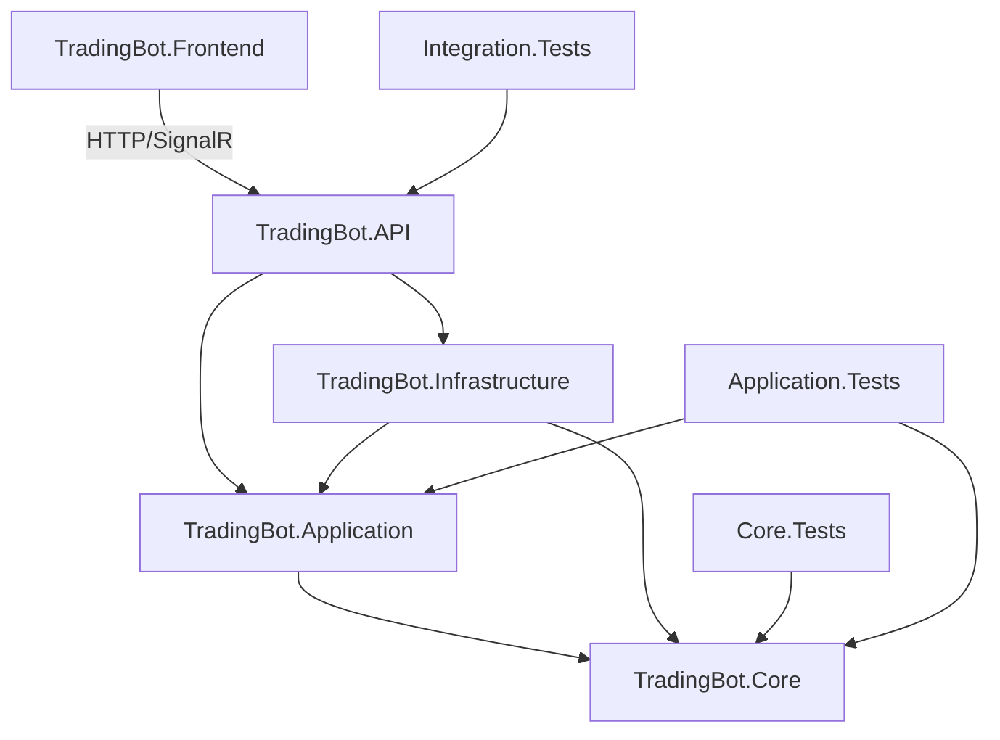

# TradingBot — Documentación del Proyecto

## 📌 Descripción General

**TradingBot** es un sistema autónomo de trading para Binance que ejecuta estrategias
y reglas configuradas por el usuario. Opera 24/7 procesando datos de mercado en tiempo
real vía WebSocket, tomando decisiones de compra/venta basadas en reglas configurables
que pueden modificarse **sin reiniciar el sistema** (hot-reload).

---

## 🎯 Objetivos del Sistema

| Objetivo           | Descripción                                                           |
|--------------------|-----------------------------------------------------------------------|
| **Autonomía**      | Opera sin intervención humana continua siguiendo reglas configuradas  |
| **Tiempo real**    | Procesa ticks de mercado con latencia < 100ms                         |
| **Flexibilidad**   | Estrategias y reglas modificables en tiempo de ejecución              |
| **Seguridad**      | Gestión de riesgo integrada, modo paper trading, límites configurables|
| **Observabilidad** | Dashboard en tiempo real, historial de operaciones, alertas           |

---

## 🏛️ Arquitectura

### Capas del Sistema
```
┌─────────────────────────────────────────────┐ │         
Blazor WebAssembly (Frontend)        │ │   Dashboard │ 
Config Estrategias │ Órdenes   │ 
└──────────────────────┬──────────────────────┘ │
SignalR / HTTP 
┌──────────────────────┴──────────────────────┐ │              
.NET 9 Web API                  │ │         Controllers │ 
SignalR Hubs           │ 
└──────────────────────┬──────────────────────┘ │ 
┌──────────────────────┴──────────────────────┐ │           
Application Layer (CQRS)           │ │  StrategyEngine │ 
RuleEngine │ RiskManager   │ │  OrderManager   │ 
MarketEngine               │ 
└──────┬───────────────────────────┬──────────┘ │                           
│ ┌──────┴───────┐         ┌─────────┴─────────┐ │  
PostgreSQL  │         │   Binance API      │ │  + Redis     │         
│  REST + WebSocket  │ └──────────────┘         
└───────────────────┘
```
---

## 🧩 Componentes Principales

### 1. Market Engine
Responsable de mantener la conexión WebSocket con Binance y distribuir eventos de mercado.

- **Entrada**: Streams de Binance (price ticks, order book, trades)
- **Salida**: Eventos `MarketTickReceived` publicados en el bus interno
- **Resiliencia**: Reconexión automática con backoff exponencial

### 2. Strategy Engine
Aplica indicadores técnicos al flujo de datos y genera señales de trading.

- Implementa `ITradingStrategy`
- Indicadores disponibles: RSI, MACD, EMA, SMA, Bollinger Bands
- Hot-reload: recarga configuración sin detener el procesamiento

### 3. Rule Engine
Evalúa condiciones configuradas por el usuario y decide si se debe actuar.

- Reglas definidas en JSON, persistidas en PostgreSQL
- Condiciones: precio, volumen, indicadores, tiempo, posición actual
- Lógica combinable: AND / OR / NOT entre condiciones

### 4. Risk Manager
Valida toda orden antes de su ejecución. **Obligatorio** en el flujo.

- Límites: máximo por orden, máximo diario, máximo de exposición
- Stop-loss automático configurable
- Validación de saldo disponible en tiempo real

### 5. Order Manager
Ejecuta órdenes en Binance vía REST API.

- Soporta: Market, Limit, Stop-Limit, OCO
- Modo Paper Trading: simula sin ejecutar en el exchange
- Notifica resultado a frontend vía SignalR

### 6. Config Service (Hot-Reload)
Permite modificar estrategias y reglas en tiempo de ejecución.

- API REST para CRUD de estrategias y reglas
- Validación de esquema antes de aplicar
- Publica evento `StrategyUpdated` para recarga en caliente
- Persistencia en PostgreSQL, caché en Redis

---

## 📊 Modelo de Datos Principal

### Estrategia (`TradingStrategy`)

```
{ "id": "uuid", "name": "RSI Crossover BTC", "symbol": "BTCUSDT", "isActive": true, "indicators": [ { "type": "RSI", "period": 14, "overbought": 70, "oversold": 30 } ], "entryRules": [], "exitRules": [], "riskConfig": { "maxOrderAmount": 100.0, "stopLossPercent": 2.0, "takeProfitPercent": 4.0 } }
```

### Regla (`TradingRule`)

``` 
{ "id": "uuid", "type": "Entry", "condition": { "operator": "AND", "conditions": [ { "indicator": "RSI", "comparator": "LessThan", "value": 30 }, { "indicator": "Price", "comparator": "GreaterThan", "value": 50000 } ] }, "action": { "type": "BuyMarket", "amountUsdt": 50.0 } }
```
## 🔌 API Endpoints Principales

### Estrategias

| Método   | Endpoint                        | Descripción               |
|----------|---------------------------------|---------------------------|
| `GET`    | `/api/strategies`               | Lista todas las estrategias |
| `GET`    | `/api/strategies/{id}`          | Obtiene una estrategia    |
| `POST`   | `/api/strategies`               | Crea una nueva estrategia |
| `PUT`    | `/api/strategies/{id}`          | Actualiza (hot-reload)    |
| `DELETE` | `/api/strategies/{id}`          | Elimina una estrategia    |
| `POST`   | `/api/strategies/{id}/activate` | Activa/desactiva          |

### Órdenes

| Método   | Endpoint           | Descripción          |
|----------|--------------------|----------------------|
| `GET`    | `/api/orders`      | Historial de órdenes |
| `GET`    | `/api/orders/open` | Órdenes abiertas     |
| `DELETE` | `/api/orders/{id}` | Cancela una orden    |

### Sistema

| Método | Endpoint              | Descripción       |
|--------|-----------------------|-------------------|
| `GET`  | `/api/system/status`  | Estado del bot    |
| `POST` | `/api/system/pause`   | Pausa el motor    |
| `POST` | `/api/system/resume`  | Reanuda el motor  |
| `GET`  | `/api/system/balance` | Balance de cuenta |

### SignalR Hub: `/hubs/trading`

| Evento (Server → Client) | Descripción                      |
|--------------------------|----------------------------------|
| `OnMarketTick`           | Tick de precio en tiempo real    |
| `OnOrderExecuted`        | Confirmación de orden ejecutada  |
| `OnSignalGenerated`      | Señal de entrada/salida generada |
| `OnAlert`                | Alerta de riesgo o sistema       |
| `OnStrategyUpdated`      | Confirmación de hot-reload       |

---

## ⚙️ Configuración del Entorno

### Variables de Entorno Requeridas

# Binance
BINANCE_API_KEY=your_api_key
BINANCE_API_SECRET=your_api_secret
BINANCE_USE_TESTNET=false
BINANCE_USE_DEMO=true

# Base de datos
POSTGRES_CONNECTION=Host=localhost;Database=tradingbot;Username=postgres;Password=...
REDIS_CONNECTION=localhost:6379

# Seguridad
DATA_PROTECTION_KEY_PATH=/keys
JWT_SECRET=your_jwt_secret

### Modos de Operación

| Modo           | Descripción                                                |
|----------------|-----------------------------------------------------------|
| `Live`         | Opera con dinero real en Binance                           |
| `Demo`         | Opera en demo.binance.com (keys de demo)                   |
| `Testnet`      | Opera en testnet.binance.vision (keys de testnet)          |
| `PaperTrading` | Simula operaciones localmente sin exchange                 |

---

##  🚦 Diagrama de Flujo de Datos



---

## 🚀 Roadmap

### Fase 1 — MVP
- [ ] Conexión WebSocket a Binance (Testnet)
- [ ] Dashboard de precios en tiempo real
- [ ] CRUD de estrategias con hot-reload
- [ ] Motor de reglas básico (RSI, precio)
- [ ] Paper Trading funcional

### Fase 2 — Core Trading
- [ ] Ejecución real de órdenes
- [ ] Risk Manager completo
- [ ] Indicadores: MACD, EMA, Bollinger Bands
- [ ] Historial de operaciones con P&L

### Fase 3 — Avanzado
- [ ] Backtesting con datos históricos
- [ ] Múltiples exchanges (extensible)
- [ ] Notificaciones (email, Telegram)
- [ ] Análisis de performance de estrategias

---

## ⚠️ Advertencia Legal

> Este software es solo para fines educativos y de investigación.
> El trading de criptomonedas conlleva riesgos significativos de pérdida de capital.
> Los autores no son responsables de pérdidas financieras derivadas del uso de este sistema.
> **Siempre prueba exhaustivamente en Testnet/Paper Trading antes de usar dinero real.**

---

## 🔄 Estado Actual del Proyecto

### ✅ Completado
- [x] Archivo de instrucciones para Copilot → `.github/copilot-instructions.md`
- [x] Documentación del proyecto → `docs/PROJECT.md`
- [x] Estructura de la solución definida (scripts `dotnet CLI` listos para ejecutar)

### ⏳ En progreso — Próximo paso
**Paso 2: Entidades del dominio en `TradingBot.Core`**
- Entidades: `TradingStrategy`, `TradingRule`, `Order`, `Position`
- Value Objects: `Symbol`, `Price`, `RiskConfig`
- Interfaces: `ITradingStrategy`, `ITechnicalIndicator`, `IOrderRepository`
- Enums: `OrderSide`, `OrderType`, `StrategyStatus`, `TradingMode`

### 📋 Pendiente
- [ ] Setup Docker Compose (PostgreSQL + Redis)
- [ ] Market Engine con WebSocket a Binance Testnet
- [ ] Strategy Engine + Rule Engine
- [ ] Risk Manager
- [ ] Order Manager + Paper Trading
- [ ] SignalR Hub
- [ ] Blazor Frontend — Dashboard

---

## 🧠 Sistema de Detección de Régimen de Mercado (v4.1)

### Scoring Híbrido
El régimen se determina mediante scoring multi-factor:
- **Trending**: +1 ADX > threshold, +1 EMA alignment (9>21>50 o inverso), +1 HH/HL consecutivos, +1 volumen > promedio
- **Ranging**: +1 ADX < threshold, +1 EMA50 flat, +1 BandWidth < 4%
- **Indefinite**: +1 EMAs desordenadas, +1 ADX < 15, +1 volumen bajo
- **Convicción mínima**: si ningún score ≥ 2 → Indefinite (bloqueo total)
- **Desempate**: ADX decide entre Trending/Ranging
- **HighVolatility**: prioridad máxima (BandWidth/ATR)

### Pipeline de Detección (orden estricto en StrategyEngine)
1. Alimentar indicadores con kline cerrada
2. Alimentar EmaAlignmentDetector + HigherHighLowDetector
3. Obtener volumeRatio (null si no ready → 0 puntos)
4. Detect regime (scoring híbrido)
5. Confirm regime (N velas bidireccional)
6. Apply hysteresis (si UseHysteresis == true)
7. IF Indefinite → bloqueo total + cierre posiciones si ExitOnRegimeChange
8. Aplicar filtro HTF HH/HL (si ready)
9. Generar señal
10. Risk management

### Estado Indefinite
- Bloqueo 100% de señales (igual que HighVolatility/Bearish)
- Si `ExitOnRegimeChange == true` → cierra posiciones abiertas
- Salir de Indefinite requiere N velas consecutivas del nuevo régimen

### Estrategias por Régimen
- `TrendingTradingStrategy`: MACD → Pullback EMA21 → EMA crossover → SMA
- `RangingTradingStrategy`: RSI → Bollinger soporte/resistencia (NO Fibonacci)
- `BearishTradingStrategy`: Solo Sell en Spot
- `DefaultTradingStrategy`: Fallback para Unknown
- `StrategyResolver`: Cache por strategyId, Indefinite/HighVol → null

### Parámetros Nuevos (congelar en optimizer)
- `RegimeConfirmationCandles` (default: 3)
- `IndefiniteAdxThreshold` (default: 15)
- `UseHysteresis` (default: true)
- EMA slope threshold para IsFlat (default: 0.05%)

---

## 🎯 AutoPilot v2 — Pool Dinámico de Símbolos

### Concepto
`SymbolPoolManager` observa 30-50 símbolos del scanner, calcula un **TradabilityScore** en tiempo real (0-100) y solo permite operar en el **Top K** (3-5) que superen un umbral mínimo (40). Coexiste con modo manual y AutoPilot v1.

### Flujo
```
MarketScanner (REST cada 5min) → candidatos → SymbolPoolManager (ciclo 90s)
  1. Actualizar universo  2. Reconciliar runners  3. TradabilityScore
  4. Histéresis (2 ciclos in/out)  5. Top K + umbral  6. SetAllowNewEntries + BlockReason
  7. Transiciones EnteredTopKAt  8. Zombie cleanup  9. Métricas vía SignalR
```

### TradabilityScore (normalización 0-1 por factor)
| Factor | Peso |
|--------|------|
| Claridad régimen | 25% |
| Fuerza ADX | 20% |
| Volumen relativo | 15% |
| ATR% saludable | 12.5% |
| BandWidth | 12.5% |
| Signal Proximity (régimen-aware) | 15% |

`finalScore = rawScore × (0.7 + 0.3 × regimeStability)`

### API Endpoints
| Método | Ruta | Descripción |
|--------|------|-------------|
| GET | `/api/symbolpool/status` | Estado general (enabled, counts) |
| GET | `/api/symbolpool/scores` | Todos los items con score + BlockReason |
| GET | `/api/symbolpool/active` | Solo Top K activos |
| POST | `/api/symbolpool/enable` | Activar pool desde UI |
| POST | `/api/symbolpool/disable` | Desactivar pool desde UI |
| POST | `/api/symbolpool/force-refresh` | Forzar ciclo inmediato |
| GET | `/api/marketdata/klines` | Klines para gráficas de velas |
| GET | `/api/orders/by-symbol/{symbol}` | Órdenes por símbolo (marcadores) |

### Frontend
- **Página**: `/symbol-pool` — Panel operativo con toggle, cards resumen, tabla de scores, gráfica de velas
- **Gráficas**: lightweight-charts v4.2.1 (TradingView) vía JS interop con marcadores compra/venta
- **SignalR**: `OnSymbolPoolUpdate` para actualizaciones en tiempo real

### Archivos principales
| Archivo | Capa |
|---------|------|
| `ISymbolPool.cs` | Core |
| `SymbolPoolConfig.cs` | Application |
| `TradabilityScorer.cs` | Application |
| `SymbolPoolManager.cs` | Application |
| `SymbolPoolSnapshot.cs` | Core/Events |
| `SymbolPoolController.cs` | API |
| `MarketDataController.cs` | API |
| `SymbolPool.razor` | Frontend |
| `TradabilityChart.razor` | Frontend |


